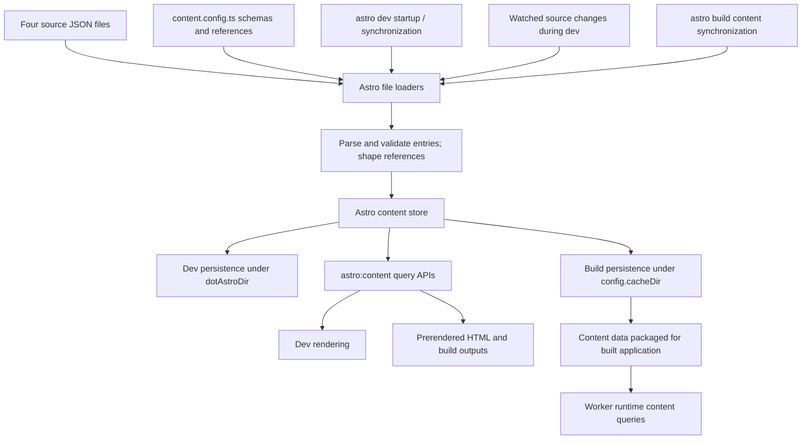
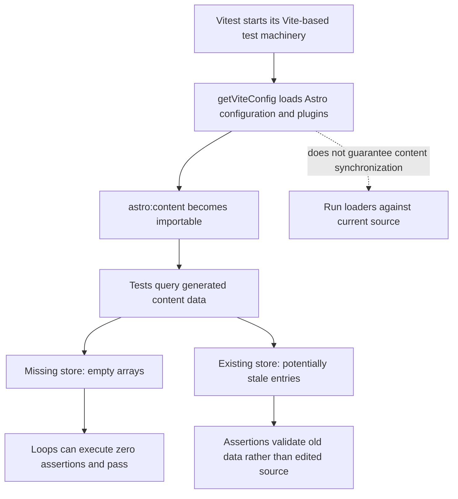
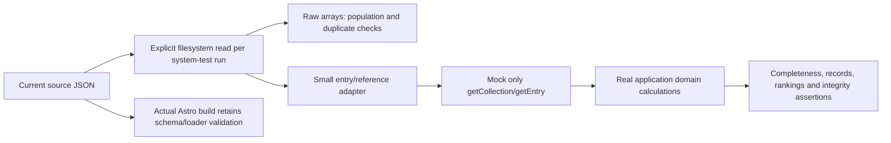
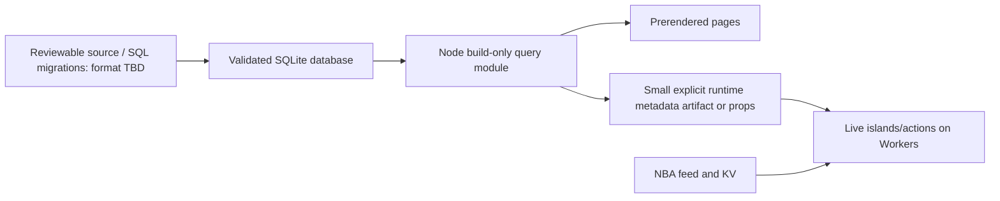

# Content lifecycle: current behavior and a future boundary

Project-specific explanation, based on the installed Astro/Vitest/Cloudflare
implementation and the R2 reproductions. This is not a promise about every Astro
version. The active application still uses collections. A later bounded
[SQLite pilot](prelaunch-review/sqlite-pilot.md) proves Node prerender plus
embedded Worker metadata; full migration remains gated. Its
[data-management guide](../sqlite-spike/README.md) supersedes the earlier
format-TBD discussion below, not the current-behavior diagrams.

## Local collections in this project



This is a conceptual lifecycle, not a complete implementation call graph. The
in-memory store, persistence and generated modules cooperate; a query is not
necessarily a filesystem read of a store file either.

**The important boundary:** `getCollection()` and `getEntry()` query loaded
content. They do not rerun the JSON file loader on each call. Runtime queries
can use data packaged at build time without running the source file loader in
Workers. Do not import `content.config.ts` into runtime code to force loading.

Dev synchronization also responds to watched source changes; it is not limited
to server startup. Build-time local collections should not be confused with
live collections, whose loaders serve request-time content. This project's four
collections use `file()`, not live loaders. The NBA live action/KV path is a
separate application mechanism.

## Why the former Vitest setup could pass incorrectly



The installed `astro/dist/config/index.js` constructs the Vite configuration with
`sync: false`. Configuring module resolution is not a content-loading contract.
`astro/dist/content/paths.js` also selects different persistence roots for dev
and build, so a successful build is not proof that Vitest's dev-side store was
refreshed. `astro sync` did not repair that guarantee in our reproductions either.

Observed in disposable copies:

- Fresh source, absent dev store: the former collection checks passed empty.
- After dev populated it: 18,607 games were visible.
- Remove one game from source: the old tests still saw 18,607 and passed.
- Refresh dev: 18,606 became visible and completeness failed, 81 versus 82.

This data-validity issue was reproduced in Node independently of workerd.

## The current bounded test solution



These are data/domain tests, not a comprehensive test of Astro's loading engine.
They intentionally have no dependency on a prewarmed Astro store. Watch-mode
source changes explicitly trigger the system tests, which reread the files.
Fresh/stale/missing-game and watch-mode negative controls have been verified.

**Stopping point:** keep those meaningful checks and only simplify duplicated
mock plumbing. Do not build an Astro synchronization harness, emulate its entire
content API or migrate test runtimes merely to validate JSON and arithmetic.

## Separate issue: Cloudflare's development plugins inside Vitest

The installed Cloudflare Vite plugin registers a Worker-oriented development
environment and dependency optimization settings. Its Node-compatibility import
resolver expects a Vite `environment.depsOptimizer` in dev mode, using it to
register imports that need compatibility handling.

Vitest uses Vite's development machinery even for a one-shot test run, but
configures test execution/dependency handling differently. Its installed
`resolveOptimizerConfig()` disables optimization unless the test optimizer is
explicitly enabled. The Cloudflare resolver encountered a dev environment
without that optimizer and asserted:

```text
AssertionError: depsOptimizer is required in dev mode
```

This is an integration/configuration mismatch, not proof that Vitest is
inherently Node-only or that workerd cannot execute tests. Ordinary Astro dev
uses the Cloudflare-configured development environment and optimization setup.
Cloudflare's dedicated Vitest integration supplies a supported Workers test
runtime; it does not itself synchronize Astro's local collections.

The current filter removes Cloudflare development plugins from the Node suite.
Whether an optimizer setting alone would resolve all remaining integration
issues has not been established; do not treat it as a verified replacement.

## Deferred SQLite direction

Aim for a project-owned data API and types, with no `astro:content` query or
`CollectionEntry` dependency. SQLite can enforce primary/foreign keys and unique
constraints (foreign-key enforcement must be enabled per connection). Real
in-memory or temporary databases can exercise the same queries and constraints
in Node tests without framework content-store initialization.

SQLite does not itself make a project static-only. A build-only design needs an
explicit import/runtime boundary:



Our application is not entirely static: live islands/actions need season/team
metadata at runtime. A build-only database therefore requires passing or
packaging that metadata, or a consciously different runtime database design.
Do not assume replacing every runtime `getEntry()` with `node:sqlite` is viable.

An explicit runtime artifact would be regenerated as part of each build, not a
persistent cache that tests silently trust. Build/runtime import restrictions
and a bundle check can enforce that the database driver stays out of Workers
and browser code. Domain constraints such as season completeness and projected
wins still deserve tests; SQL foreign keys do not replace them.

The database/source format, precise boundary and conversion are future design
work, not Foundations cutover requirements.
